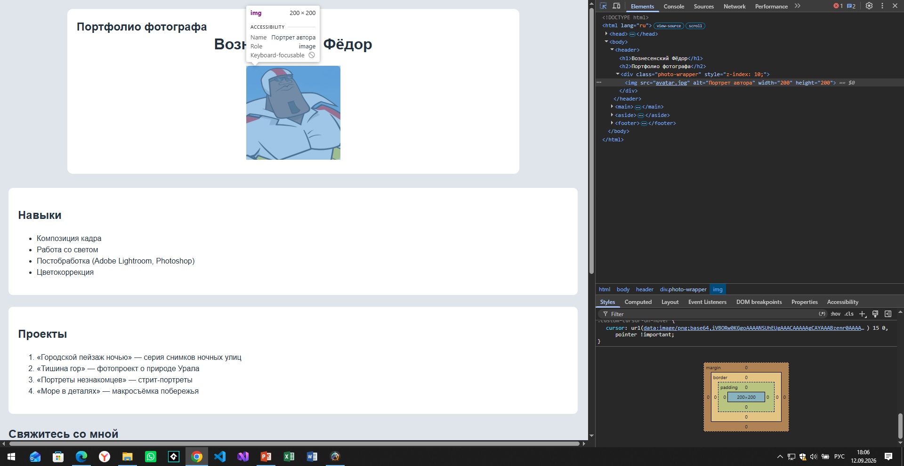
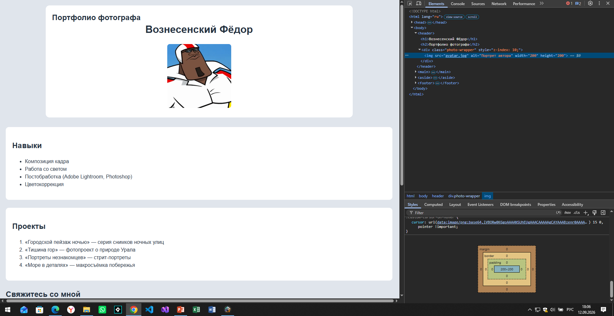
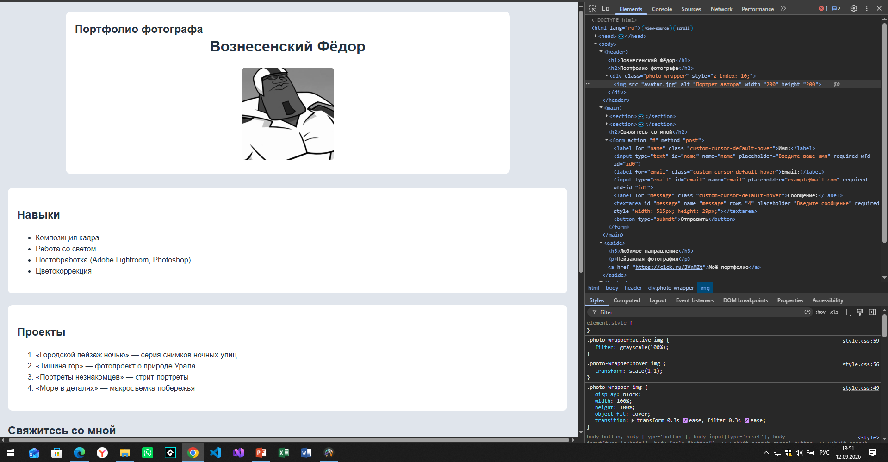
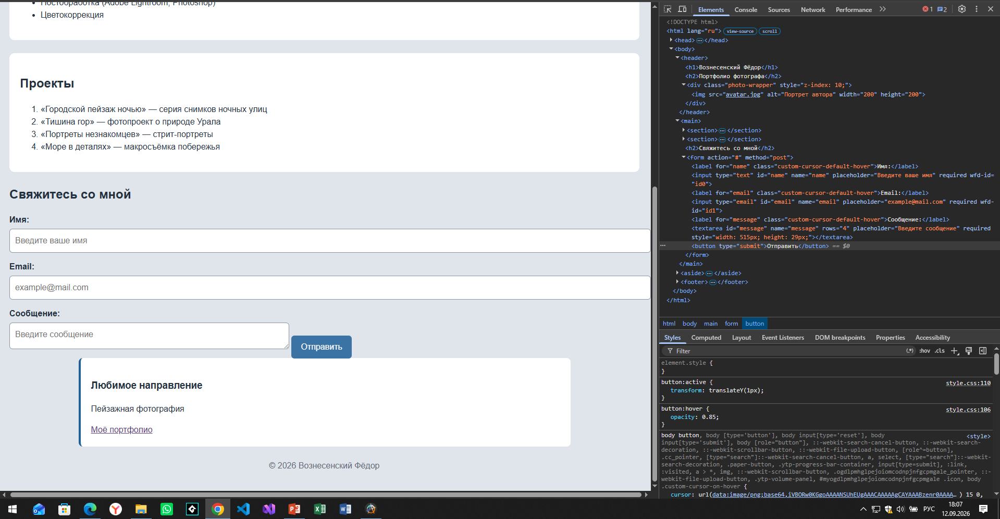
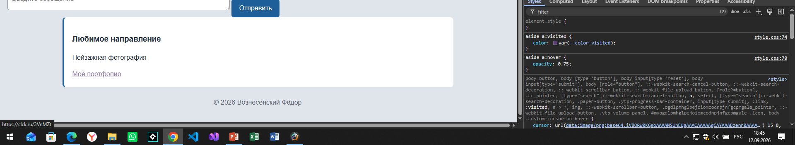

# Лабораторная работа: «Портфолио фотографа»

**Вариант 11**
**Тема:** Фотограф и визуальный сторителлер

## Описание

Одностраничный сайт-портфолио фотографа. Страница содержит информацию об авторе, его навыках, фотопроектах и форму обратной связи. Дизайн выполнен в серо-синей цветовой гамме с использованием CSS-переменных и интерактивных эффектов.

## Структура страницы

* **Шапка (`<header>`)**
  Имя и фамилия (`<h1>`), заголовок страницы (`<h2>`) и аватар автора.

* **Основной контент (`<main>`)**

  * Секция **«Навыки»** — маркированный список (`<ul>`) с основными навыками фотографа.
  * Секция **«Проекты»** — нумерованный список (`<ol>`) из четырёх фотопроектов.
  * **Форма обратной связи** — поля «Имя», «Email», «Сообщение» и кнопка отправки.

* **Боковая панель (`<aside>`)**
  Указано любимое направление — пейзажная фотография, а также ссылка на портфолио.

* **Подвал (`<footer>`)**
  Копирайт с именем автора и годом.

## Особенности CSS

Использованы CSS-переменные для цветов и шрифтов, псевдоклассы `:hover`, `:active`, `:focus`, `:visited`, а также эффекты масштабирования и изменения цвета изображения.

## Проверка DevTools

### 1. Проверка выхода за рамки фото

Проверяется свойство `overflow: hidden` у блока с фотографией.

### 2. Проверка увеличения и смены цвета фото

При наведении на фотографию она увеличивается, а при нажатии становится чёрно-белой.

### 3. Проверка кнопки на смену положения

Проверяется изменение положения кнопки при её нажатии с помощью свойства `transform`.

### 4. Проверка ссылки на цвет

Проверяется изменение цвета ссылки после посещения (`:visited`).

## Запуск

Откройте файл `index.html` в любом современном браузере.
